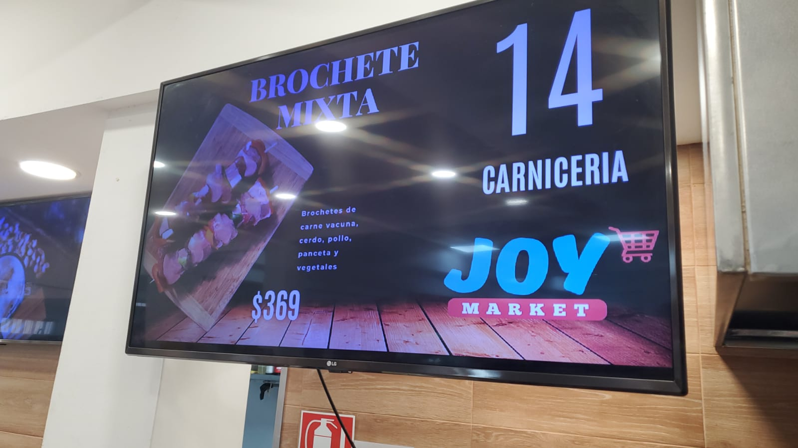

# Contador-Supermercado-JOY

Software creado para el supermercado de pando JOY, termino siendo usado en 2 supermercados mas del pinar

Es un sistema que muestra el numero de la persona que va en pantalla, el logo del sitio, el texto de la estacion y un numero a elegir de imagenes promocionales, cuenta con funciones para aumentar el numero haciendo sonido y mostrandolo en pantalla como tambien para bajarlo o subirlo sin hacer ruido.

Funciona con una base de datos MySQL y un segundo programa que se conecta a esa BDD para customizar lo que se desee del programa como el sonido, las imagenes, los colores del texto, el propio texto, el tiempo que se muestra la imagen o el numero, etc..

Interfaz:

Programado por Joaquin Bonifacino
